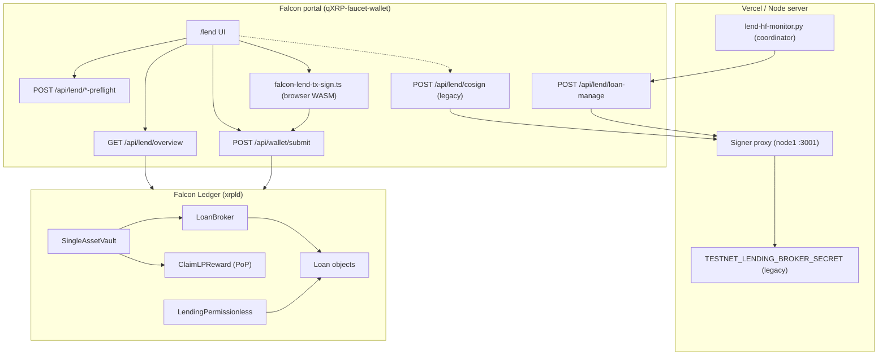

# Falcon Ledger Lending — Implementation Report

**Date:** 2026-07-14  
**Network:** Falcon Ledger Testnet (network ID `1001`, RPC `http://46.224.0.140:6005`)  
**Status:** End-to-end supply, permissionless borrow, repay, and liquidation verified on-ledger (coordinator E2E scripts + portal `/lend`). HF monitor daemon deployed on coordinator.

> **Borrowers do not need a broker.** With `LendingPermissionless` enabled on testnet (live since ledger ~126464), borrow is **collateral-only**: post FALCON at ≥150% health factor, sign `LoanSet` yourself — no broker co-sign, no broker first-loss cover, no server secret. Legacy broker co-sign below is **historical only** (pre-permissionless).

---

## 1. Executive summary

Falcon Ledger lending is built on upstream **XRPL XLS-66** primitives (`SingleAssetVault`, `LendingProtocol`, `MPTokensV1`) plus qXRP extensions:

- **`ClaimLPReward`** — Proof-of-Participation LP epoch emissions (FALCON)
- **`LendingCollateral`** — FALCON collateral locked in `LoanSet`
- **`LendingPermissionless`** — collateral-only borrow without broker `CounterpartySignature`; permissionless liquidation

The **protocol implementation** lives in the `qXRP` repository; the **user-facing lending loop** is wired in the `qXRP-faucet-wallet` portal at `/lend`.

| Capability | Portal | On-chain |
|------------|--------|----------|
| Supply F-USDC to vault | ✅ `VaultDeposit` | ✅ |
| Borrow F-USDC (permissionless — **current**) | ✅ `LoanSet` + FALCON collateral | ✅ `LendingPermissionless` live on testnet |
| Borrow F-USDC (legacy broker — **retired**) | Optional co-sign path in code | Pre-July 2026 only; not required |
| Repay loan | ✅ `LoanPay` (Pay full amount) | ✅ |
| Withdraw supply | ✅ `VaultWithdraw` | ✅ |
| Claim LP epoch rewards | ✅ `ClaimLPReward` | ✅ FALCON (PoPL) |
| FALCON collateral in `LoanSet` | ✅ | ✅ `LendingCollateral` |
| Add collateral to open loan | ✅ `LoanCollateralDeposit` (Positions) | ✅ tx type **83** (`LendingCollateral`) |
| Pickable borrow duration | ✅ 1–52 PoPL epochs + interest preview | ✅ `PaymentInterval` + `PaymentTotal` on `LoanSet` |
| Health factor display (AMM price) | ✅ borrow preview + Positions + risk monitor | UI + daemon |
| On-chain liquidation / impairment | ✅ `LoanManage` + HF monitor daemon | ✅ anyone can default on HF breach or late payment |
| Borrow / repay / claim / withdraw preflight | ✅ `/api/lend/*-preflight` | simulate before sign |
| Multi-loan Positions UI | ✅ loan selector | filters paid/closed loans |

### Economics

- **LP interest:** `LoanPay` returns principal + interest in **F-USDC** to the vault. LP share value rises — there is no separate interest claim transaction.
- **LP emissions:** `ClaimLPReward` distributes **FALCON** from the epoch PoPL participation split.
- **Liquidation:** on default, the **liquidator receives FALCON collateral**. The vault books collateral value at AMM price (`collateralVaultValue`); any residual shortfall reduces vault F-USDC accounting. LPs are not paid out in FALCON on default.

Liquidity in the lend pool is **real F-USDC** (QUC IOU from issuer `rsJoDhjVV78jr6huHxKjtT8uG8RGeGmd1N`), not bootstrap-minted supply.

**Verified permissionless E2E (2026-07-14):** borrow **5 F-USDC** + repay **5.000069** (`tesSUCCESS`); HF-breach liquidation with third-party `LoanManage` default (`tesSUCCESS`). See §7.

*Historical (legacy broker path, 2026-07-10):* wallet `rwcYXAAXe7unkEwPVFWMbyzXE2ajG3juqR` — borrow 10 F-USDC with broker co-sign; repay **10.000137** F-USDC.

---

## 2. Architecture



### Repositories

| Repo | Role |
|------|------|
| `qXRP` | xrpld fork: transactors, `LendingHelpers`, `LendingPermissionless`, HF monitor scripts, fleet amendment enablement |
| `qXRP-faucet-wallet` | Portal: `/lend` UI, overview aggregation, preflight APIs, client tx signing, optional broker co-sign |

### Amendments (enable order)

1. **MPTokensV1** — vault share tokens (MPT) for LP positions  
2. **SingleAssetVault** — `VaultCreate`, `VaultDeposit`, `VaultWithdraw`  
3. **LendingProtocol** — `LoanBrokerSet`, `LoanSet`, `LoanPay`, `LoanManage`  
4. **LendingCollateral** — `Collateral` field on `LoanSet`; FALCON locked on-chain; **`LoanCollateralDeposit`** (tx 83) adds FALCON to an existing loan  
5. **LendingPermissionless** — collateral-only borrow; permissionless `LoanManage` default  

Fleet scripts: `qXRP/scripts/enable-lending-fleet.sh`, `qXRP/scripts/enable-lending-permissionless-fleet.sh`.

---

## 3. On-chain objects (testnet)

Authoritative manifest: `qXRP-faucet-wallet/public/config/lending.json`

| Item | Value |
|------|-------|
| Network ID | `1001` |
| F-USDC currency | `QUC` |
| F-USDC issuer | `rsJoDhjVV78jr6huHxKjtT8uG8RGeGmd1N` |
| Vault ID | `0DB363B417A560EDD7EA8306188F5592F2388A054BF7F6AC1FB5A99A30BC99B2` |
| Loan broker ID | `0DF028DFE8928921B9474B5EB09531E1E7A3655441C53ECFECF41C82F374D334` |
| Broker owner (legacy) | `rJePmBhHoerhB4gJPAPEqvVBgQ7xbmY6bh` — not a borrow gate once permissionless is live |
| Interest | `500` tenth-bips = **5% APR** |
| PoPL epoch duration | `604800` s (7 days) |
| Default loan duration | `1` epoch (borrower-selectable **1–52** epochs in portal) |
| Payment interval | `epochs × 604800` s (bullet loan: one payment at maturity) |
| Payment total | `1` (single-installment bullet loans; multi-installment deferred) |
| Grace period | `3600` s (1 hour) |

### Collateral constants (`LendingHelpers.h`)

| Constant | Value | Meaning |
|----------|-------|---------|
| `kPermissionlessMinCollateralBps` | 15000 | Min HF 1.5 at borrow (150% collateralization) |
| `kPermissionlessLiquidationHfBps` | 11000 | Liquidatable when HF &lt; 1.1 |

Price source: FALCON/F-USDC AMM mid. Loans without broker co-sign carry `lsfLoanPermissionless`.

---

## 4. Protocol rules

### 4.1 Vault (supply side)

- **VaultDeposit** — LP sends F-USDC; receives vault share MPT.
- **VaultWithdraw** — LP burns share MPT; receives F-USDC (FCFS).
- **ClaimLPReward** — LP claims FALCON epoch emission by vault share balance.

### 4.2 Permissionless borrow (`LendingPermissionless` + `LendingCollateral`)

- **LoanSet** — borrower signs only; includes `Collateral` (FALCON drops); no `CounterpartySignature`.
- `Lending::checkPermissionlessCollateral` enforces HF ≥ 1.5 at AMM price.
- Broker cover check is skipped; loan flagged `lsfLoanPermissionless`.

### 4.3 Legacy broker borrow (retired — historical reference only)

> Not used on testnet after `LendingPermissionless` fleet enable. Documented for protocol completeness only.

- **LoanSet** — previously required broker `CounterpartySignature` and `CoverAvailable ≥ 1% × debt`.
- **LoanBrokerCoverDeposit** — operator posted F-USDC first-loss cover.

### 4.4 Loan lifecycle

- **LoanPay** — installment must be ≥ periodic payment (principal + interest/fees). Principal-only → `tecINSUFFICIENT_PAYMENT`.
- **LoanManage (permissionless)** — any account may:
  - `impair` when HF &lt; 1.1
  - `default` when HF &lt; 1.1 **or** payment past grace period
- **Default settlement** (`defaultPermissionlessLoan`):
  1. Transfer FALCON collateral to liquidator
  2. Credit vault `AssetsAvailable` by collateral value at AMM price (up to debt owed)
  3. Reduce vault `AssetsTotal` by residual F-USDC shortfall

### 4.5 Rate encoding

1 tenth-bip = 0.0001%; 100,000 tenth-bips = 100%.

---

## 5. Portal implementation

### 5.1 UI (`/lend`)

| Tab | Panel | Transaction |
|-----|-------|-------------|
| Overview | Pool stats, APY, risk monitor | Read-only |
| Supply | `LendSupplyPanel` | `VaultDeposit` |
| Borrow | `LendBorrowPanel` | `LoanSet` (duration picker: 1–52 PoPL epochs) |
| Positions | `LendPositionsPanel` | `VaultWithdraw`, `LoanPay`, `ClaimLPReward`, `LoanCollateralDeposit` |

When `protocol.lendingPermissionless && protocol.lendingCollateral`, borrow skips co-sign and shows permissionless copy.

### 5.2 API routes

| Route | Purpose |
|-------|---------|
| `GET /api/lend/overview` | Vault, broker, epoch/PoP, AMM price, loans, LP positions, amendment flags |
| `POST /api/lend/borrow-preflight` | Collateral HF, vault liquidity, `PaymentInterval` from loan epochs |
| `POST /api/lend/collateral-deposit-preflight` | Add-collateral HF check, `LendingCollateral` gate |
| `POST /api/lend/repay-preflight` | Installment + wallet balance |
| `POST /api/lend/claim-preflight` | Claim eligibility |
| `POST /api/lend/withdraw-preflight` | Share balance + vault utilization |
| `POST /api/lend/supply-preflight` | F-USDC balance + trust line |
| `GET /api/lend/risk-monitor` | Fleet-wide HF scan |
| `POST /api/lend/loan-manage` | HF daemon / ops: `impair` / `unimpair` / `default` |
| `POST /api/lend/cosign` | Legacy testnet broker co-sign |
| `POST /api/wallet/submit` | Submit signed `tx_blob` |

### 5.3 Client transaction signing (`falcon-lend-tx-sign.ts`)

| Function | Transaction |
|----------|-------------|
| `signVaultDepositTx` | `VaultDeposit` |
| `signVaultWithdrawTx` | `VaultWithdraw` |
| `signClaimLPRewardTx` | `ClaimLPReward` |
| `signLoanSetBorrowerTx` | `LoanSet` |
| `signLoanCollateralDepositTx` | `LoanCollateralDeposit` (tx 83) |
| `signLoanPayTx` | `LoanPay` |

### 5.4 Error UX (`lend-borrow-errors.ts`)

- `borrowBlockedReason` — skips broker cover when permissionless; checks cosign only on legacy path
- `repayBlockedReason` / `fullRepayAmount` — installment-aware repay
- `collateralBlockedReason` (`lend-collateral.ts`) — 150% min collateral at AMM price

---

## 6. End-to-end flows

### 6.1 Supply

1. User holds F-USDC + trust line  
2. Lend → Supply → passkey → `VaultDeposit`  
3. Vault share MPT received; `AssetsAvailable` increases  

### 6.2 Borrow (permissionless — target path)

1. Portal checks collateral HF ≥ 1.5, vault liquidity (`borrow-preflight`)  
2. Borrower picks duration (1–52 PoPL epochs); portal sets `PaymentInterval = epochs × 604800`, `PaymentTotal = 1`  
3. Borrower signs `LoanSet` with `Collateral` — no co-sign  
4. Submit → F-USDC to borrower; FALCON locked on loan  

**Add collateral (open loan):** Positions → Add collateral → `collateral-deposit-preflight` → `LoanCollateralDeposit` increases on-ledger `Collateral`.

### 6.3 Borrow (legacy broker — retired)

Historical path only. Permissionless borrowers **skip** broker cover and co-sign entirely.

### 6.4 Repay

1. UI auto-fills exact `PeriodicPayment` (e.g. `10.000137`)  
2. `LoanPay` → F-USDC to vault (LP yield via share value)  

### 6.5 Claim LP rewards

`ClaimLPReward` → FALCON from epoch emission.

### 6.6 Liquidation

`lend-hf-monitor.py` on coordinator scans loans → `POST /api/lend/loan-manage` with `default` or `impair`. Any account can also submit `LoanManage` on permissionless loans when eligible.

---

## 7. End-to-end test program (coordinator)

All permissionless lending E2E tests run **on-ledger** against live testnet RPC (`http://46.224.0.140:6005`) from the **coordinator** (`root@46.224.0.140`) using admin RPC signing. No portal passkey or broker co-sign is required for these scripts.

### 7.1 Fleet and amendment status

| Item | Value |
|------|-------|
| Docker image | `qxrp/xrpld:lending-v2` (commits `12a67ea64` `LoanCollateralDeposit` + epoch constants, `c30da2dc4` E2E fix) |
| Fleet | 7/7 nodes on `lending-v2` via `bin/install/rolling-upgrade-fleet.sh` (image `docker save`/`load` — local build, not Docker Hub) |
| `LendingPermissionless` | Enabled at flag ledger ~**126464** (5/5 votes + 15-min hold) |
| `LoanCollateralDeposit` | Tx type **83** — live on `lending-v2` fleet |
| Coordinator container | `qxrp-full` |
| Validated ledger (report date) | ~**143887** |

### 7.2 E2E scripts (`qXRP/scripts/`)

| Script | Purpose | Exit criteria |
|--------|---------|---------------|
| `lend-e2e-permissionless.py` | Supply (optional) → permissionless borrow → repay | All steps `tesSUCCESS` |
| `lend-e2e-collateral-deposit.py` | Borrow → `LoanCollateralDeposit` (+50 FALCON) | Collateral increases on loan |
| `lend-e2e-liquidation.py` | Borrow → AMM price shock → `LoanManage` default | Liquidator receives FALCON collateral |
| `lend-hf-monitor.py` | HF + payment-default enforcement daemon | `LoanManage` when HF &lt; 1.1 or late payment |
| `deploy-lend-hf-monitor.sh` | Install systemd unit `qxrp-lend-hf-monitor.service` | Service active on coordinator |

**Run (coordinator):**

```bash
python3 /root/qXRP/scripts/lend-e2e-permissionless.py
python3 /root/qXRP/scripts/lend-e2e-collateral-deposit.py
python3 /root/qXRP/scripts/lend-e2e-liquidation.py
python3 /var/lib/qxrp-lending/lend-hf-monitor.py --once --dry-run
```

### 7.3 Test harness design

Each E2E script:

1. Loads state from `/var/lib/qxrp-stables/stables_state.json`, `lending_state.json`, `/root/qxrp-bootstrap/faucet.json`
2. Proposes fresh Falcon wallets via `wallet_propose` (admin RPC)
3. Funds wallets from faucet (`rwzhiWW4GYK2sQVR5Lw4iDpYLANB5krJXY`, ~390k FALCON)
4. Signs and submits via `docker exec qxrp-full curl` → admin `:5005` / public `:6005`
5. Waits for validated ledger confirmation per tx

**Wallet roles (liquidation script):**

| Role | Source | Purpose |
|------|--------|---------|
| Borrower | `wallet_propose` | `LoanSet` permissionless borrow |
| Liquidator | `wallet_propose` | Third-party `LoanManage` default (proves no broker needed) |
| Price dumper | Faucet account | AMM swap: sell FALCON → F-USDC (`Payment` + `tfPartialPayment`) |

Validator fleet accounts are **not** used for E2E — bonded FALCON and key isolation make the faucet the correct whale account on the coordinator.

### 7.4 Test A — Permissionless borrow + repay ✅

**Script:** `lend-e2e-permissionless.py`

**Flow:**

```
fund lender + borrower (2000 FALCON each)
→ trust lines (QUC / F-USDC)
→ issuer mint F-USDC (30 lender / 15 borrower)
→ VaultDeposit 20 F-USDC OR supply_skip if vault AssetsAvailable ≥ 10
→ LoanSet: 5 F-USDC principal, FALCON collateral @ 1.5 HF (+5% buffer)
→ LoanPay: full installment rounded UP to 6 dp
```

**Loan terms (script):**

| Field | Value |
|-------|-------|
| `PrincipalRequested` | `5` F-USDC |
| `InterestRate` | `500` tenth-bips (5% APR) |
| `PaymentInterval` | `604800` s (1 PoPL epoch = 7 days) |
| `PaymentTotal` | `1` |
| `GracePeriod` | `3600` s |
| `Flags` | `tfLoanOverpayment` (`0x00010000`) |
| Collateral | `ceil(5 × 1.5 / AMM_price × 1.05)` FALCON |

**Representative PASS run (2026-07-14):**

| Wallet | Address |
|--------|---------|
| Lender | `rUW5jpzLpEbfZ9GwpUk4Gs9iqoon4zTtY8` |
| Borrower | `rPxzyo4FdL7Pt7LekxpvTLTK2bLHZQBum8` |

| Step | Tx hash | Result |
|------|---------|--------|
| Borrow 5 F-USDC (875 FALCON collateral) | `78E3A2528B1C40FD09082D6249B65FC6EE1ECE9FE6F8B106E3E20F3FF81AC172` | tesSUCCESS |
| Repay **5.000069** F-USDC | `93B058510F90402CD34F12BF83C83BBDF684C6D2F8E06749AF3310892097E719` | tesSUCCESS |

**Repay lesson:** `PeriodicPayment` on-chain is `5.000068493150794935`. Paying principal only (`5`) or truncated interest → `tecINSUFFICIENT_PAYMENT`. Portal and script use **ceil to 6 decimal places** (`5.000069`) — matches “Pay full amount” in UI.

**Supply skip:** When vault `AssetsAvailable` ≥ principal + buffer, script skips `VaultDeposit` to avoid intermittent `tecINVARIANT_FAILED` on repeated small deposits into a large vault (~255 F-USDC available at time of testing).

### 7.5 Test B — Add collateral (`LoanCollateralDeposit`) ✅

**Script:** `lend-e2e-collateral-deposit.py`

**Flow:**

```
fund borrower (3000 XRP + 2500 FALCON from faucet)
→ LoanSet: 5 F-USDC, PaymentInterval 604800 (1 epoch)
→ LoanCollateralDeposit: +50 FALCON
→ assert on-ledger Collateral increased
```

**Representative PASS run (2026-07-14, `lending-v2` fleet):**

| Step | Result | Notes |
|------|--------|-------|
| Borrow 5 F-USDC | tesSUCCESS | 3549 FALCON collateral @ AMM price |
| `LoanCollateralDeposit` +50 FALCON | tesSUCCESS | Collateral 3549 → 3599 FALCON |

Requires `qxrp/xrpld:lending-v2` (tx type 83). Prior `tecINSUFFICIENT_FUNDS` on borrow was fixed by funding FALCON, not only XRP.

### 7.6 Test C — Permissionless liquidation (HF breach) ✅

**Script:** `lend-e2e-liquidation.py`

**Flow:**

```
fund borrower + liquidator
→ borrower trust line
→ LoanSet @ minimum 1.5 HF (no 5% buffer)
→ faucet trust line (receive F-USDC from AMM dumps)
→ faucet AMM dumps (sell FALCON for F-USDC until HF < 1.1)
→ liquidator LoanManage tfLoanDefault
→ assert lsfLoanDefault + liquidator FALCON balance += collateral
```

**Health factor math (matches on-chain `loanHealthFactorBps`):**

```
HF = (collateral_FALCON × AMM_FUSDC_per_FALCON) / debt_FUSDC
Liquidatable when HF < 1.1  (11,000 bps)
```

**AMM dump mechanism:** Self-`Payment` from faucet to faucet:

- `SendMax`: FALCON drops to sell
- `Amount`: max F-USDC to receive (must be large — **not** `1` USDC or price barely moves)
- `DeliverMin`: slippage floor
- `Flags`: `tfPartialPayment` (`0x00020000`)

**Representative PASS run (2026-07-14, latest):**

| Wallet | Address |
|--------|---------|
| Borrower | `r3XK65UbcEhsif3UjWbqNdKeD28TBeSc62` |
| Liquidator | `rJM5vq5umHp82iztWHsZySAoUSMuD5VbgT` |
| Price dumper | `rwzhiWW4GYK2sQVR5Lw4iDpYLANB5krJXY` (faucet) |

| Step | HF / price | Tx hash | Result |
|------|------------|---------|--------|
| Borrow 5 F-USDC, 1928 FALCON | HF **1.501** @ 0.003892 | `0834FB47C0FB9CDE0D32E57FCD7666D54AD31A972BDB07FDF97C3601A63ED645` | tesSUCCESS |
| AMM dump 4000 FALCON | HF **1.231** @ 0.003194 | `43E459BC0FB5C36B5D0CFAE7053E29DBDD0E40A72A4B7F5C8603B17D075A1984` | tesSUCCESS |
| AMM dump 8000 FALCON | HF **0.856** @ 0.002219 | `989B04758E4BC7AFE598B73496DBCE48ABDA99CF002BFFF854E8898514734DBE` | tesSUCCESS |
| Liquidator default | — | `BA1C8431CEBDE5812DC9315EDE6B56FAAB4FCF0A592C0911303A3949DFA6588D` | tesSUCCESS |

**Post-liquidation:** Liquidator FALCON **2000 → 3928** (+1928 collateral). Loan `AE6D230E…` flagged `lsfLoanDefault`.

**On-chain settlement (`defaultPermissionlessLoan` in `LoanManage.cpp`):**

1. FALCON collateral transferred from broker pseudo-account to **liquidator** (`account_` on `LoanManage`)
2. Vault `AssetsAvailable` credited by collateral value at AMM price (capped at debt owed)
3. Vault `AssetsTotal` reduced by any F-USDC shortfall
4. Loan debt fields zeroed; `lsfLoanDefault` set

### 7.7 HF monitor daemon ✅

**Service:** `qxrp-lend-hf-monitor.service` on coordinator  
**Binary:** `/var/lib/qxrp-lending/lend-hf-monitor.py`  
**Interval:** 60 s loop  
**State:** `/var/lib/qxrp-lending/hf_monitor_state.json`

**Actions (permissionless loans):**

| Condition | `LoanManage` flag |
|-----------|-------------------|
| HF &lt; 1.1 | `tfLoanImpair` |
| HF &lt; 1.1 or payment past grace | `tfLoanDefault` |
| Impaired + HF ≥ 1.1 | `tfLoanUnimpair` |

Broker secret loaded from `stables_state.json` `liquidity_provider.falcon_secret` or `TESTNET_LENDING_BROKER_SECRET`. For permissionless default, **any account** may submit — daemon uses broker owner for legacy loans; E2E uses a random liquidator wallet.

### 7.8 Portal session (2026-07-10, legacy broker path)

Wallet: `rwcYXAAXe7unkEwPVFWMbyzXE2ajG3juqR`

| Step | Result | Notes |
|------|--------|-------|
| Vault deposit | ✅ | 100 F-USDC |
| AMM create | ✅ | 15,000 FALCON + 150 F-USDC |
| Borrow 10 F-USDC | ✅ | Legacy `LoanSet` + broker co-sign |
| Repay 10.000137 F-USDC | ✅ | Ledger **30899**, tx `71307F0B…` |

### 7.9 E2E coverage matrix

| Scenario | Coordinator script | Portal | Status |
|----------|-------------------|--------|--------|
| Vault supply | ✅ (optional step) | ✅ | PASS |
| Permissionless borrow | ✅ | ✅ | PASS |
| Pickable borrow duration (1–52 epochs) | — | ✅ | PASS (portal + `LoanSet` fields) |
| Add collateral to open loan | ✅ | ✅ | PASS (`LoanCollateralDeposit`) |
| Full installment repay | ✅ | ✅ | PASS |
| HF breach liquidation | ✅ | Risk monitor UI | PASS |
| Payment-default liquidation | HF monitor | — | Not E2E’d (24h interval) |
| Broker legacy borrow + co-sign | — | ✅ | PASS (2026-07-10) |
| `ClaimLPReward` | — | ✅ | Prior sessions |
| Impair / unimpair only | HF monitor | — | Daemon logic; not isolated E2E |

### 7.10 Live pool state (post-liquidation E2E, 2026-07-14)

| Metric | Value |
|--------|-------|
| AMM FALCON | ~47,984 FALCON |
| AMM F-USDC | ~106.5 F-USDC |
| AMM price | ~0.002219 F-USDC/FALCON (depressed by repeated E2E dumps) |
| Vault `AssetsTotal` | ~257.6 F-USDC |
| Vault `AssetsAvailable` | ~247.6 F-USDC |

---

## 8. Operations guide

### 8.1 Bootstrap (coordinator)

```bash
bash scripts/enable-lending-fleet.sh --wait
# After lending-v2 docker image is built (LoanCollateralDeposit + epoch constants):
# Distribute locally: docker save qxrp/xrpld:lending-v2 | ssh <node> docker load
DOCKER_IMAGE=qxrp/xrpld:lending-v2 bash bin/install/rolling-upgrade-fleet.sh
bash scripts/enable-lending-permissionless-fleet.sh --wait
python3 scripts/issue-testnet-stables.py
python3 scripts/bootstrap-testnet-lending.py
```

HF monitor:

```bash
bash scripts/deploy-lend-hf-monitor.sh
python3 /var/lib/qxrp-lending/lend-hf-monitor.py --once --dry-run
journalctl -u qxrp-lend-hf-monitor -f
```

E2E regression (coordinator):

```bash
python3 scripts/lend-e2e-permissionless.py
python3 scripts/lend-e2e-collateral-deposit.py
python3 scripts/lend-e2e-liquidation.py
```

### 8.2 Vercel / portal env

| Variable | Required for | Notes |
|----------|----------------|-------|
| Testnet RPC | All | Overview + submit |
| `TESTNET_LENDING_BROKER_SECRET` | Legacy co-sign + HF daemon | Remove after permissionless live |
| `SIGNER_PROXY_URL` / `SIGNER_PROXY_TOKEN` | Legacy co-sign + daemon | |
| `LEND_HF_MONITOR_TOKEN` | HF monitor → `loan-manage` | Optional bearer auth |

---

## 9. Security model

| Asset | Model |
|-------|--------|
| User Falcon seed | Passkey-encrypted in IndexedDB; browser-only signing |
| Broker owner secret | Server-only; legacy co-sign + daemon — not needed for permissionless borrow |
| Permissionless borrow | No gatekeeper; collateral + HF enforced on-ledger |
| Co-sign route | Testnet-only, origin-checked, `LoanSet` only (legacy) |

---

## 10. Known gaps

### Remaining testnet / portal

- Payment-default liquidation E2E (wait for `PaymentInterval` + `GracePeriod` — impractical in quick scripts)
- Portal “Liquidate” button for third-party liquidators (today: HF monitor, `loan-manage` API, or coordinator scripts)
- Retire `TESTNET_LENDING_BROKER_SECRET` if legacy co-sign fully unused
- Live APY from epoch `EmissionRate` in overview
- AMM price recovery after repeated E2E dumps (pool depth testing)

### Mainnet considerations

- Permissionless collateral-only borrow — no broker operator
- Do not bootstrap-mint F-USDC into vault (bridge-only)
- Liquidation under thin AMM depth / manipulation resistance
- HF monitor liveness and MEV on `LoanManage` default

---

## 11. File reference

### Portal (`qXRP-faucet-wallet`)

| Path | Purpose |
|------|---------|
| `src/app/lend/page.tsx` | Lend page orchestration |
| `src/components/lend/LendPanels.tsx` | UI panels |
| `src/app/api/lend/overview/route.ts` | Overview aggregation |
| `src/app/api/lend/borrow-preflight/route.ts` | Borrow preflight + epoch duration |
| `src/app/api/lend/collateral-deposit-preflight/route.ts` | Add-collateral preflight |
| `src/lib/lend-loan-terms.ts` | PoPL epoch duration, interest estimate |
| `src/lib/lend-collateral-deposit.ts` | Add-collateral helpers |
| `src/app/api/lend/loan-manage/route.ts` | LoanManage submit |
| `src/app/api/lend/cosign/route.ts` | Legacy broker co-sign |
| `src/lib/falcon-lend-tx-sign.ts` | Tx builders |
| `src/lib/lend-borrow-errors.ts` | Pre-flight + error copy |
| `src/lib/lend-collateral.ts` | HF math, min collateral |
| `src/lib/lend-loan-manage.ts` | LoanManage action helpers |
| `public/config/lending.json` | On-chain IDs + terms |

### Protocol (`qXRP`)

| Path | Purpose |
|------|---------|
| `src/libxrpl/tx/transactors/lending/LoanSet.cpp` | Borrow + permissionless path |
| `src/libxrpl/tx/transactors/lending/LoanCollateralDeposit.cpp` | Add FALCON to open loan (tx 83) |
| `scripts/lend_epoch_constants.py` | 7-day epoch `PaymentInterval` helpers |
| `scripts/lend-e2e-collateral-deposit.py` | Coordinator E2E: borrow + add collateral |
| `src/libxrpl/tx/transactors/lending/LoanManage.cpp` | Impair/default + `defaultPermissionlessLoan` |
| `src/libxrpl/ledger/helpers/LendingHelpers.cpp` | HF bps, collateral checks, AMM price |
| `scripts/enable-lending-permissionless-fleet.sh` | Amendment activation |
| `scripts/lend-hf-monitor.py` | HF enforcement daemon |
| `scripts/deploy-lend-hf-monitor.sh` | systemd install for HF monitor |
| `scripts/lend-e2e-permissionless.py` | Coordinator E2E: borrow + repay |
| `scripts/lend-e2e-liquidation.py` | Coordinator E2E: HF breach + default |

---

## 12. Conclusion

Falcon Ledger lending is a **verified vertical slice** on testnet:

- **`LendingPermissionless`** enabled fleet-wide; collateral-only `LoanSet` without broker co-sign
- **`lending-v2` fleet** includes `LoanCollateralDeposit` (tx 83) and 7-day PoPL epoch loan duration via `PaymentInterval`
- **Coordinator E2E** confirms borrow, add collateral, repay (6 dp ceil), and third-party liquidation via AMM price shock
- **HF monitor** running on coordinator for automated `LoanManage` enforcement
- **Portal** `/lend` wired for permissionless borrow, duration picker (1–52 epochs), Positions add-collateral, HF display, risk monitor, and preflight APIs

The most common user-facing confusion — **`tecINSUFFICIENT_PAYMENT` while holding ample F-USDC** — is a protocol requirement to pay **principal + interest/fees per installment**. The portal and E2E scripts surface the exact due amount (`5.000069` for a `5` F-USDC single-payment loan at 5% APR over 1 epoch).

Next priorities: optional portal liquidator UX, payment-default E2E, and mainnet hardening under realistic AMM depth.