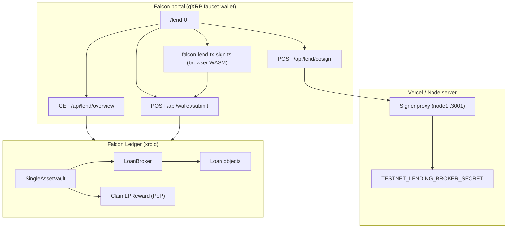

# Falcon Ledger Lending — Implementation Report

**Date:** 2026-07-10  
**Network:** Falcon Ledger Testnet (network ID `1001`, RPC `http://46.224.0.140:6005`)  
**Status:** End-to-end supply, borrow, and repay verified on testnet via the Falcon portal (`/lend`)

---

## 1. Executive summary

Falcon Ledger lending is built on upstream **XRPL XLS-66** primitives (`SingleAssetVault`, `LendingProtocol`, `MPTokensV1`) plus qXRP extensions (`ClaimLPReward` for Proof-of-Participation LP emissions). The **protocol implementation** lives in the `qXRP` repository; the **user-facing lending loop** is wired in the `qXRP-faucet-wallet` portal at `/lend`.

On testnet today:

| Capability | Portal | On-chain |
|------------|--------|----------|
| Supply F-USDC to vault | ✅ `VaultDeposit` | ✅ |
| Borrow F-USDC from vault | ✅ `LoanSet` + broker co-sign | ✅ |
| Repay loan | ✅ `LoanPay` | ✅ |
| Withdraw supply | ✅ `VaultWithdraw` | ✅ |
| Claim LP epoch rewards | ✅ `ClaimLPReward` | ✅ |
| FALCON collateral in `LoanSet` | ✅ | ✅ `LendingCollateral` amendment locks FALCON on-chain |
| Health factor display (AMM price) | ✅ borrow preview + Positions | UI math only |
| On-chain liquidation | ❌ | `LoanManage` not wired; daemon HF enforcement pending |

Liquidity in the lend pool is **real F-USDC** (QUC IOU from issuer `rsJoDhjVV78jr6huHxKjtT8uG8RGeGmd1N`), not bootstrap-minted “fake” supply. Borrowers require **broker first-loss cover** on the loan broker before `LoanSet` succeeds.

A full round-trip was verified on wallet `rwcYXAAXe7unkEwPVFWMbyzXE2ajG3juqR`: borrow **10 F-USDC**, failed repay attempts at **10** and **5** (`tecINSUFFICIENT_PAYMENT`), successful repay at **10.000137 F-USDC** (`tesSUCCESS`, ledger **30899**, tx `71307F0BA93F8062D3F80056B7E33802753CE2BF1DCD0E664B24EC9CFF843DF5`).

---

## 2. Architecture



### Repositories

| Repo | Role |
|------|------|
| `qXRP` | xrpld fork: transactors, invariants, `LendingHelpers`, bootstrap scripts, fleet amendment enablement |
| `qXRP-faucet-wallet` | Portal: `/lend` UI, overview aggregation, client tx signing, broker co-sign API |

### Amendments (enable order)

1. **MPTokensV1** — vault share tokens (MPT) for LP positions  
2. **SingleAssetVault** — `VaultCreate`, `VaultDeposit`, `VaultWithdraw`, …  
3. **LendingProtocol** — `LoanBrokerSet`, `LoanSet`, `LoanPay`, `LoanManage`, …  

Fleet script: `qXRP/scripts/enable-lending-fleet.sh` (patch validator configs + `feature` RPC votes).

---

## 3. On-chain objects (testnet)

Authoritative manifest: `qXRP-faucet-wallet/public/config/lending.json`

| Item | Value |
|------|-------|
| Network ID | `1001` |
| F-USDC currency | `QUC` |
| F-USDC issuer | `rsJoDhjVV78jr6huHxKjtT8uG8RGeGmd1N` |
| Vault ID | `0DB363B417A560EDD7EA8306188F5592F2388A054BF7F6AC1FB5A99A30BC99B2` |
| Loan broker ID | `0DF028DFE8928921B9474B5EB09531E1E7A3655441C53ECFECF41C82F374D334` |
| Broker owner | `rJePmBhHoerhB4gJPAPEqvVBgQ7xbmY6bh` |
| Interest (manifest) | `500` tenth-bips = **5% APR** (portal hardcodes same for `LoanSet`) |
| Payment interval | `86400` s (1 day) |
| Payment total | `1` (single-installment test loans) |
| Grace period | `3600` s (1 hour) |

**Snapshot after verified repay (2026-07-10 ~22:13 UTC, ledger 30899):**

| Metric | Value |
|--------|-------|
| Vault `AssetsTotal` / `AssetsAvailable` | **200.000137** F-USDC (10 principal + interest returned to pool) |
| Broker `CoverAvailable` | **30** F-USDC |
| Broker `DebtTotal` | **0** (was 10.000137 before repay) |
| Wallet F-USDC balance | **~60.00** F-USDC (70 before − 10.000137 repay) |
| Loan `PrincipalOutstanding` / `TotalValueOutstanding` | **null** (fully paid; ledger object may persist) |

Bootstrap intentionally starts with **zero** vault seed and **zero** genesis broker cover (`VAULT_SEED_DEPOSIT=0`, `COVER_ASSET_VALUE=0` in `bootstrap-testnet-lending.py`). LPs fund the vault via the portal; the operator posts cover via `deposit-testnet-broker-cover.py`.

---

## 4. Protocol rules (what the chain enforces)

### 4.1 Vault (supply side)

- **VaultCreate** — one asset per vault (testnet: QUC IOU). Issues **share MPT** to LPs.
- **VaultDeposit** — LP sends F-USDC to vault pseudo-account; receives vault share MPT.
- **VaultWithdraw** — LP burns share MPT; receives F-USDC (FCFS policy).
- **ClaimLPReward** (qXRP) — LP claims FALCON emission by vault share balance and epoch state (separate from XLS-66).

### 4.2 Loan broker (operator)

- **LoanBrokerSet** — vault owner creates broker attached to vault. Sets:
  - `CoverRateMinimum` — testnet bootstrap: **1000** tenth-bips = **1%** of broker debt must be covered
  - `CoverRateLiquidation` — **2500** = 2.5%
  - `ManagementFeeRate` — **100** = 0.1% of interest to broker
  - `DebtMaximum` — cap on total broker debt
- **LoanBrokerCoverDeposit** — broker **owner** deposits F-USDC into broker pseudo-account (`CoverAvailable`).

**Borrow gate:** at `LoanSet`, if `CoverAvailable < 1% × (DebtTotal + new principal + interest)`, result is **`tecINSUFFICIENT_FUNDS`** — this is *not* vault liquidity; it is missing broker cover.

### 4.3 Loan lifecycle (borrow / repay)

- **LoanSet** — borrower requests principal from vault liquidity.
  - Requires **`CounterpartySignature`** from loan broker owner (co-sign).
  - Requires vault `AssetsAvailable ≥ principal`.
  - Creates `Loan` ledger object on borrower account.
- **LoanPay** — borrower sends F-USDC; protocol applies payment to principal, interest, and management fees per amortization math (`LendingHelpers.cpp`).
  - **Regular installment** must be ≥ **periodic payment** (principal + accrued interest/fees), rounded per asset scale.
  - Paying **only principal** (e.g. `10` when due is `10.000137`) → **`tecINSUFFICIENT_PAYMENT`**.
  - **Partial payments below the installment minimum are not supported** for regular `LoanPay` on this loan type.
  - Overpayment flag `tfLoanOverpayment` on `LoanSet` allows early payoff semantics when enabled.
- **LoanManage** — default / impairment (not exposed in portal UI).

### 4.4 Rate encoding

From `xrpl::Lending`: **1 tenth-bip = 0.0001%**; **100,000 tenth-bips = 100%**.

---

## 5. Portal implementation

### 5.1 UI (`/lend`)

| Tab | Panel | Transaction |
|-----|-------|-------------|
| Overview | `LendPoolOverviewPanel` | Read-only pool stats |
| Supply | `LendSupplyPanel` | `VaultDeposit` |
| Borrow | `LendBorrowPanel` | `LoanSet` |
| Positions | `LendPositionsPanel` | `VaultWithdraw`, `LoanPay`, `ClaimLPReward` |

**Wallet auth:** passkey → decrypt Falcon seed in browser → WASM sign → `POST /api/wallet/submit`.

### 5.2 API routes

#### `GET /api/lend/overview?address=r…`

Aggregates protocol readiness, vault info, broker node, epoch/PoP data, AMM market price, wallet F-USDC balance, user loans (`account_objects` type `loan`), LP share MPT positions, and pool-wide contributor/borrower stats.

Key derived flags:

- `protocol.txSigningReady` — amendments on + `lending.json` has vault and broker IDs  
- `lending.cosignReady` — `TESTNET_LENDING_BROKER_SECRET` set on server  

#### `POST /api/lend/cosign` (testnet only)

1. Validates `LoanSet` and `LoanBrokerID` against manifest  
2. Signs `CounterpartySignature` via signer proxy (`SIGNER_PROXY_URL`) using broker owner secret  
3. Returns dual-signed `tx_blob` for client submit  

Broker secret **never** reaches the browser.

#### `POST /api/wallet/submit`

Submits signed `tx_blob` via public RPC `submit`.

### 5.3 Client transaction signing

File: `src/lib/falcon-lend-tx-sign.ts`

| Function | Transaction |
|----------|-------------|
| `signVaultDepositTx` | `VaultDeposit` |
| `signVaultWithdrawTx` | `VaultWithdraw` |
| `signClaimLPRewardTx` | `ClaimLPReward` |
| `signLoanSetBorrowerTx` | `LoanSet` (borrower signature only) |
| `signLoanPayTx` | `LoanPay` |

Sequence handling: `submitWithSequenceRetry` in `wallet-submit.ts` retries on `tefPAST_SEQ` / `terPRE_SEQ`.

### 5.4 Error UX

File: `src/lib/lend-borrow-errors.ts`

| Helper | Purpose |
|--------|---------|
| `borrowBlockedReason` | Pre-flight: cosign, vault liquidity, broker cover |
| `repayBlockedReason` | Pre-flight: installment ≥ periodic payment, wallet balance |
| `suggestedRepayAmount` | Exact `PeriodicPayment` string from ledger |
| `explainLendSubmitError` | Maps `tecINSUFFICIENT_FUNDS`, `tecINSUFFICIENT_PAYMENT`, etc. |

Borrow failures from empty broker cover are explicitly documented (common testnet pitfall).

### 5.5 Repay UX (2026-07-10)

The repay flow was hardened after live `tecINSUFFICIENT_PAYMENT` failures while the wallet held ample F-USDC.

**Overview API** (`/api/lend/overview`) now exposes per-loan:

| Field | Source | Purpose |
|-------|--------|---------|
| `paymentDueFusdc` | `Loan.PeriodicPayment` | Parsed installment (principal + interest/fees) |
| `paymentDueRaw` | `Loan.PeriodicPayment` (string) | Exact ledger string for `LoanPay` amount |
| `totalOutstandingFusdc` | `Loan.TotalValueOutstanding` | Full payoff amount when applicable |

**Positions panel** (`LendPositionsPanel`):

- Amber “Repay borrow” card with four-quadrant breakdown: principal, interest+fees, total due, wallet balance
- Auto-fills repay input from `suggestedRepayAmount()` on loan load
- “Use due” button sets exact `paymentDueRaw`
- `repayBlockedReason()` disables submit before passkey if amount &lt; installment or &gt; wallet balance
- `explainLendSubmitError()` maps `tecINSUFFICIENT_PAYMENT` to actionable copy

**Interest on the verified loan:** 10 F-USDC principal at 5% APR (500 tenth-bips), 1-day interval → periodic payment ≈ **10.000137** F-USDC (principal 10 + ~0.000137 interest/fees). Paying **10** or **5** correctly fails on-chain.

### 5.6 Configuration chain

```
public/config/testnet-stables.json  → F-USDC issuer (QUC / rsJoDhj…)
public/config/lending.json          → vault_id, loan_broker_id, broker_owner, loan terms
.env (Vercel)                       → TESTNET_LENDING_BROKER_SECRET, SIGNER_PROXY_*
```

---

## 6. End-to-end flows

### 6.1 Supply (lend pool liquidity)

1. User holds F-USDC + trust line to issuer  
2. Lend → Supply → amount → passkey  
3. `VaultDeposit` → user receives vault **share MPT** (shown as “Lend share” on wallet dashboard)  
4. Vault `AssetsAvailable` increases — this is what borrowers draw from  

### 6.2 Borrow

1. Portal checks `borrowBlockedReason` (cover, liquidity, cosign)  
2. Borrower signs `LoanSet` (`PrincipalRequested`, broker ID, terms)  
3. `POST /api/lend/cosign` adds broker `CounterpartySignature`  
4. Submit → vault transfers F-USDC to borrower; `Loan` object created  
5. Broker `DebtTotal` increases; cover must still satisfy 1% rule  

### 6.3 Repay

1. Overview loads `PeriodicPayment` and `TotalValueOutstanding` from loan object  
2. UI shows breakdown: principal vs interest/fees vs **total due** vs wallet balance  
3. User must pay **≥ periodic payment** (e.g. `10.000137`, not `10`)  
4. `LoanPay` → vault receives F-USDC; loan closed when fully paid  

### 6.4 Withdraw supply

1. Positions → withdraw amount  
2. `VaultWithdraw` burns share MPT, returns F-USDC  
3. *(Gap: no client-side check against share balance or vault utilization)*  

### 6.5 Claim LP rewards

1. Positions → “Claim lender rewards”  
2. `ClaimLPReward` for configured `vaultId`  
3. *(Gap: UI does not gate on `canClaim` or show estimated reward)*  

---

## 7. Verified testnet session (2026-07-10)

Wallet: `rwcYXAAXe7unkEwPVFWMbyzXE2ajG3juqR`  
Sepolia bridge: `0x1e6838624c6538cfb39eb2d223064ce524178f03`

| Step | Result | Notes |
|------|--------|-------|
| Bridge in / F-USDC mint | ✅ | Multiple mints; ~300 F-USDC received from issuer |
| Vault deposit | ✅ | 100 F-USDC to lend pool |
| AMM create | ✅ | 15,000 FALCON + 150 F-USDC pool |
| Borrow 10 F-USDC | ✅ | `LoanSet` + broker co-sign after cover posted |
| Repay 10 F-USDC | ❌ `tecINSUFFICIENT_PAYMENT` | Principal only; interest/fees not included |
| Repay 5 F-USDC | ❌ `tecINSUFFICIENT_PAYMENT` | Below installment minimum |
| Repay **10.000137** F-USDC | ✅ `tesSUCCESS` | Full installment; loan repaid |
| Bridge out 70 F-USDC | ✅ | `sepolia-withdraw` memo; Sepolia USDC released |

**Successful repay transaction:**

| Field | Value |
|-------|-------|
| Type | `LoanPay` |
| Amount | `10.000137` F-USDC (QUC) |
| Result | `tesSUCCESS` |
| Ledger | **30899** |
| Tx hash | `71307F0BA93F8062D3F80056B7E33802753CE2BF1DCD0E664B24EC9CFF843DF5` |
| Loan ID | `683E2798565B109E9806E823025632438B1008B38337632BCA332BF7A229091B` |
| Vault effect | `AssetsAvailable` 190 → **200.000137** |
| Broker effect | `DebtTotal` 10.000137 → **0** |

**Failed repay attempts (same session):**

| Amount | Result | Tx hash (prefix) |
|--------|--------|------------------|
| 10 F-USDC | `tecINSUFFICIENT_PAYMENT` | `4FBE958197B3D5F7…` |
| 5 F-USDC | `tecINSUFFICIENT_PAYMENT` | `72CF7E0FFE32A94C…` |

**Lesson documented in portal:** wallet F-USDC balance (70) was sufficient; repay amount must match **installment due**, not displayed principal alone.

**Post-repay ledger note:** a paid `Loan` object can remain in `account_objects` with `PrincipalOutstanding` / `TotalValueOutstanding` cleared but `PeriodicPayment` retained. The portal maps missing outstanding fields to **0** principal; a future improvement is to hide or label closed loans.

---

## 8. Operations guide

### 8.1 Bootstrap (coordinator)

```bash
# 1. Enable amendments (fleet)
bash scripts/enable-lending-fleet.sh --wait

# 2. Issue stables (prerequisite)
python3 scripts/issue-testnet-stables.py

# 3. Create vault + broker + portal manifest
python3 scripts/bootstrap-testnet-lending.py

# 4. Post broker cover before borrows
export TESTNET_LENDING_BROKER_SECRET=...
export SIGNER_PROXY_URL=http://46.224.0.140:3001
python3 scripts/deposit-testnet-broker-cover.py --amount 30
```

### 8.2 Vercel / portal env

| Variable | Required for | Notes |
|----------|----------------|-------|
| `TESTNET_LENDING_BROKER_SECRET` | Borrow | Broker owner Falcon secret (co-sign) |
| `SIGNER_PROXY_URL` | Borrow | HTTP signer on validator fleet |
| `SIGNER_PROXY_TOKEN` | Borrow | Auth token for proxy |
| `XRPLD_RPC_URL` / testnet RPC | All | Overview + submit |
| `ALLOWED_ORIGINS` | Cosign/submit | CSRF protection |

### 8.3 Monitoring

| RPC | Use |
|-----|-----|
| `vault_info` | Pool size, shares outstanding |
| `ledger_entry` `{ loan_broker: id }` | `CoverAvailable`, `DebtTotal` |
| `ledger_data` `{ type: loan }` | Active borrowers |
| `account_objects` `{ type: loan }` | Per-wallet loans |

---

## 9. Security model

| Asset | Model |
|-------|--------|
| User Falcon seed | Passkey-encrypted in IndexedDB; decrypted only in browser for signing |
| Broker owner secret | Server-only (`TESTNET_LENDING_BROKER_SECRET`); used only in co-sign route |
| Co-sign route | Testnet-only, origin-checked, `LoanSet` only, broker ID must match manifest |
| Submit route | Rate-limited; no private keys |

**First-loss cover** is economic security for lenders: broker posts F-USDC that absorbs losses before vault LP principal. Minimum cover scales with outstanding broker debt (1% on testnet).

---

## 10. Known gaps and documentation drift

### Not implemented in portal

- On-chain liquidation (`LoanManage` + daemon health-factor enforcement)
- Multi-loan repay UI (only `loans[0]`)
- Closed/paid `Loan` ledger entries may still appear in Positions with 0 principal
- Claim rewards UX polish (`canClaim`, estimated reward)
- Withdraw preflight (share balance, vault liquidity)
- Supply preflight (F-USDC balance check beyond trust line)
- Mainnet broker co-sign / HSM flow

### Docs behind code

- Regenerated lending PDF (`Docs/FALCON-LENDING-IMPLEMENTATION-REPORT.pdf`) may lag this markdown until rebuilt.

### Mainnet considerations

- Do **not** bootstrap-mint F-USDC into vault (bridge-only policy).
- Broker cover must be operator-funded, not protocol-inflated.
- Co-sign secret handling needs production-grade key management.

---

## 11. File reference

### Portal (`qXRP-faucet-wallet`)

| Path | Purpose |
|------|---------|
| `src/app/lend/page.tsx` | Lend page orchestration |
| `src/components/lend/LendPanels.tsx` | UI panels |
| `src/app/api/lend/overview/route.ts` | Overview aggregation |
| `src/app/api/lend/cosign/route.ts` | Broker co-sign |
| `src/lib/falcon-lend-tx-sign.ts` | Tx builders |
| `src/lib/lend-borrow-errors.ts` | Pre-flight + error copy |
| `src/lib/lend-pool-stats.ts` | Pool contributor/borrower stats |
| `src/lib/lend-loan-onchain.ts` | Read `Collateral` from Loan ledger objects |
| `src/lib/lend-collateral.ts` | HF math, min collateral, liquidation threshold |
| `public/config/lending.json` | On-chain IDs + terms |

### Protocol (`qXRP`)

| Path | Purpose |
|------|---------|
| `src/libxrpl/tx/transactors/vault/` | Vault transactors |
| `src/libxrpl/tx/transactors/lending/` | Loan broker + loan transactors |
| `src/libxrpl/ledger/helpers/LendingHelpers.cpp` | Payment math |
| `scripts/bootstrap-testnet-lending.py` | Vault/broker bootstrap |
| `scripts/deposit-testnet-broker-cover.py` | Cover deposits |
| `scripts/enable-lending-fleet.sh` | Amendment activation |

---

## 12. Conclusion

Falcon Ledger lending on testnet is a **working vertical slice**: real F-USDC vault liquidity, broker-gated borrows with server co-sign, and repay via `LoanPay` with interest-aware installments. The portal at `/lend` implements the full signer loop; the protocol enforces cover, liquidity, and payment sufficiency on-ledger.

The most common user-facing confusion—**`tecINSUFFICIENT_PAYMENT` while holding ample F-USDC**—is a protocol requirement to pay **principal + interest/fees per installment**, not principal alone. The portal now surfaces the exact due amount, auto-fills it, and blocks underpayment before passkey signing.

Next priorities for production readiness: on-chain liquidation (`LoanManage`), claim/withdraw validation, and mainnet key-management for broker co-sign.